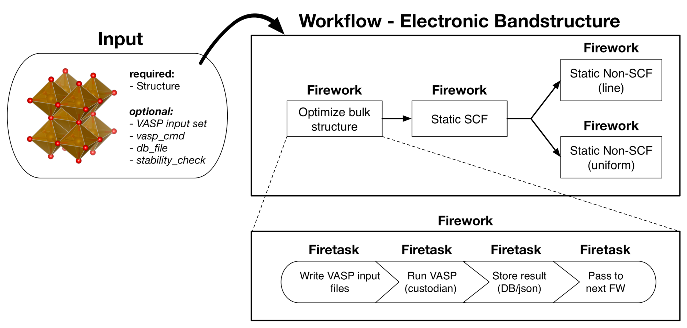

.. title:: Creating workflows
.. _creating workflows:

==================
Creating Workflows
==================

Introduction
============

The :ref:`running workflows tutorial` walked you through customizing and running a preset VASP workflow from the library of YAML files. While these presets are useful standards for making specific, straightforward calculations, it is often desirable to create your own workflows.

Ideally, custom workflows can be constructed entirely with existing Fireworks. Generally speaking, any workflow that is a series of calculations where only the input files and calculation settings change can be constructed from existing Fireworks. The workflow can have either a simple or complex dependency graph. This guide will explain how to create such custom workflows in Python.

If your desired workflow cannot be created with existing Fireworks, you'll have to code your own Fireworks. It should be mostly straightforward to do so by looking at the currently implemented Fireworks in atomate and using that as a guide to code your own. For now, we will assume that the Fireworks you need already exist.

Objectives
==========

* Get familiar with the internal structure of Workflows, Fireworks, and Firetasks
* Learn to compose atomate Workflows in Python from existing Fireworks
* Understand what powerups are and how to use them
* Learn how the FireWorker environment can control behavior

Prerequisites
=============

In order for you to understand this guide you should

    * Have a working installation of atomate
    * Understand how to add Workflows to your FireWorks LaunchPad and run them
    * Be comfortable with Python functions and classes

FireWorks Background
====================

All of the machinery for constructing workflows in atomate is from `FireWorks`_, which is a generalized library for constructing and running workflows. atomate uses the FireWorks library to construct workflows that combine materials science manipulation and analysis implemented in pymatgen_, database communication from pymatgen-db_, and job running from custodian_. The FireWorks documentation provides many excellent tutorials and guides for using and understanding the use of the library, which may be useful.

A FireWorks Workflow is made up of Fireworks, which are made up of Firetasks. The description of each of these is best described by the `FireWorks documentation`_ itself:

.. pull-quote::

    * A Workflow is a set of FireWorks with dependencies between them. For example, you might need a parent Firework to finish and generate some output files before running two child FireWorks.
    * A Firework contains the JSON spec that includes all the information needed to bootstrap your job. For example, the spec contains an array of Firetasks to execute in sequence. The spec also includes any input parameters to pass to your Firetasks. You can easily perform the same function over different input data by creating Fireworks with identical Firetasks but different input parameters in the spec. You can design your spec however you’d like, as long as it’s valid JSON. The JSON format used for Firework specs is extremely flexible, very easy to learn (Python users familiar with dicts and arrays essentially already know JSON), and immediately makes rich searches over the input data available to end users through MongoDB’s JSON document search capabilities.
    * A Firetask is an atomic computing job. It can call a single shell script or execute a single Python function that you define (either within FireWorks, or in an external package).

In atomate, we typically design each Firework to represent one calculation or analysis step. In the example below, a typical bandstructure calculation first optimizes a crystal structure, then performs a static calculation, and finally non-SCF calculations on the band path and uniformly though the structure (which can be executed in parallel since they are not dependent on one another). Each of these calculations (each time you would run VASP) corresponds to a Firework and thus this bandstructure workflow contains 4 Fireworks. One could design this workflow with more or less Fireworks, but in our opinion this is the most natural and useful mapping. For example, note that one Firework most typically corresponds to one queue submission on a supercomputing center (although this can vary depending on the chosen execution mode).

The Firetasks of each Firework are all of the individual steps that are performed for each calculation step. In the example, the structure optimization Firework has tasks to write the VASP input files based on the input structure, run VASP, parse the VASP outputs, and pass the output structure on to the static calculation. For the purposes of this tutorial, you don’t need to worry much about the details of Firetasks, but it helps to appreciate that Fireworks are simply composed of a few of these tasks performed in sequence that allow one to abstract out tedious calculation details like file IO. In the same way, Workflows exist to abstract out the details of different calculation and analysis steps contained in FireWorks.

    Bandstructure workflow. The Optimize bulk structure Firework is a parent with one child: a Static SCF Firework. The Static SCF Firework has two children: a Static Non-SCF (line) Firework and a Static Non-SCF (uniform) Firework to get the DOS on a path and uniformly, respectively. In terms of execution, the Optimize bulk structure Firework will run the four Firetasks in sequential order with data as described by the spec. Once the Optimize bulk structure Firework and Static SCF Firework complete, the line and uniform SCF Fireworks can be launched and executed in parallel or in series. Since these Fireworks do not depend on each other, the execution order does not matter. Similar to the Optimize structure Firework, all of these Fireworks will run their respective Firetasks in series.

.. _pymatgen: http://pymatgen.org
.. _custodian: https://materialsproject.github.io/custodian/
.. _FireWorks: https://pythonhosted.org/FireWorks/
.. _pymatgen-db: https://materialsproject.github.io/pymatgen-db/
.. _FireWorks documentation: https://pythonhosted.org/FireWorks/index.html#workflow-model

Creating atomate Workflows
==========================

Sketch the workflow
-------------------

The first step when you go to write any workflow is to sketch a graph of the workflow. In particular, you want to sketch a `directed acyclic graph`_, which for atomate just means that each calculation step is a node in the graph and parents only point to their children such that there are no loops (cycles) in the graph. Again, you should think of each large single invocation of the scientific code (VASP, LAMMPS, etc.) as corresponding to one Firework. Analysis tasks that aggregate results from several Fireworks, e.g. tasks that analyze volume deformations, also need their own Fireworks that have the calculations as parents. All of the workflow examples in the docs and the atomate paper (submitted) are valid workflow graphs.

.. note::

    An advanced method of workflow programming in the FireWorks package allows the workflow to change depending on the results of execution. For example, a Firework can add more Fireworks to the workflow based on results that it obtained. If you need some kind of looping or branching at a high level, you'll have to write a custom Firetask that creates new Fireworks on the fly. Writing custom Firetasks in atomate may be covered more in depth in a future workflow, but it is beyond the scope of this guide. `Fireworks documentation for dynamic workflows`_ discusses this from an abstract perspective.

.. _directed acyclic graph: https://en.wikipedia.org/wiki/Directed_acyclic_graph
.. _Fireworks documentation for dynamic workflows: https://pythonhosted.org/FireWorks/dynamic_wf_tutorial.html

Finding Fireworks
-----------------

Once you have identified each calculation or analysis step as a Firework in our graph, we must determine which Fireworks correspond to each node in our graph. The full Python documentation for each of the atomate Fireworks can be found in the :py:mod:`atomate.vasp.fireworks module <atomate.vasp.fireworks>` documentation or the corresponding documentation page for the software you want to use. Currently FEFF, LAMMPS, and VASP are supported. Some available VASP Fireworks are

* OptimizeFW
* StaticFW
* TransmuterFW
* HSEBSFW
* NonSCFFW
* LepsFW
* SOCFW
* MDFW
* BoltztrapFW
* NEBRelaxationFW
* NEBFW

.. warning:: The majority of these Fireworks are not complicated to run and you can use them directly. Some are less obvious and you should refer to the documentation for the specifics of each of these and how to use them before you do. For example, the HSEBSFW requires a previous calculation that gives VBM/CBM information or the high-symmetry kpoints.

.. note:: Some of these Fireworks only differ in VASP settings or options. For example, a simple OptimizeFW could in principle be customized to achieve the same functionality as several other VASP Fireworks in the same way that two types of burgers at a fast-food restaurant might become equivalent if you customized each order enough.

One of the main settings to pay attention to, particularly in VASP, is the input set used which determines things like functional, pseudopotential, and convergence settings. The input sets are all defined in pymatgen, such as `pymatgen.io.vasp.sets`_ or `pymatgen.io.feff.sets`_. Most of these are fairly straightforward, but one Firework to pay specific attention to is the TransmuterFW. The TransmuterFW is very powerful because it supports transforming structures by any of the transformations supported in `pymatgen.transformations`_. There are many supported transformations in pymatgen, some of the more common transformations include

* SupercellTransformation: Create supercells from a scaling matrix
* SubstitutionTransformation: Substitute one species for another
* PerturbStructureTransformation: Applies a perturbation of a specified amplitude to each site
* DeformStructureTransformation: Apply a deformation matrix to the lattice matrix of the structure

You'll notice that more generic Fireworks and Fireworks for analysis tasks are not in this list. Because they are intended to be simple and modular, these Fireworks are actually written as plain Firetasks that will get wrapped into a Firework when the Workflow is constructed. We’ll cover how to use them as Fireworks in the next section, but know that they can be found at places like :py:mod:`atomate.common.firetasks module <atomate.common.firetasks>` for software-agnostic tasks such as ``PassCalcLocs`` or :py:mod:`atomate.vasp.firetasks package <atomate.vasp.firetasks` for some VASP specific ones, including the analysis tasks usually found in :py:mod:`atomate.vasp.firetasks.parse_outputs`.

.. _pymatgen.io.vasp.sets: http://pymatgen.org/pymatgen.io.vasp.sets.html
.. _pymatgen.io.feff.sets: http://pymatgen.org/pymatgen.io.feff.sets.html
.. _pymatgen.transformations: http://pymatgen.org/pymatgen.transformations.html

Creating the workflow
---------------------

With each of the Fireworks identified for our sketched workflow, they can assemble them into a complete atomate Workflow in Python. In order to understand what's going on here, you should be comfortable with creating instances of classes and using functions. To demonstrate how to assemble and use a workflow, we will use a slightly modified version of the Gibbs Free Energy Workflow and step through each line of code to explain what is going on.

For context, the Gibbs Free Energy Workflow calculates :math:`G(P,T)` for a structure. Two methods for doing this are using the Debye model (see `link me to debye`_) or through vibration frequencies of atoms (see `Togo and Tanaka, Scr. Mater., 108 (2015)`_. It does this by first optimizing the desired structure. Next, that optimized structure has its volume scaled and a VASP calculation that is either a static calculation or calculation with density functional perturbation theory (the ``IBRION = 7 or 8`` INCAR setting) is performed depending on what type of analysis is used. In the analysis, the Debye model or a phonon calculation is used to extrapolate the from 0K to finite temperatures using the harmonic approximation, giving each structure an :math:`F(T)` dependence. Then each of these structures are considered together and fit to an equation of state which allows us express :math:`F(V,T)` for this structure, which we can transform to :math:`G(P,T)` to get the Gibbs free energy of that structure. The phonopy website has a `good visualization for Helmholtz energies and volumes with increasing temperature`_.

The Python implementation of the modified Gibbs Free Energy Workflow is:

.. code-block:: python
    :linenos:

    from __future__ import absolute_import, division, print_function, unicode_literals
    from datetime import datetime
    from pymatgen.analysis.elasticity.strain import Deformation
    from pymatgen.io.vasp.sets import MPRelaxSet, MPStaticSet
    from fireworks import Firework, Workflow
    from atomate.vasp.fireworks.core import OptimizeFW, TransmuterFW
    from atomate.vasp.firetasks.parse_outputs import GibbsFreeEnergyTask

    def wf_gibbs_free_energy(structure, deformations, vasp_input_set_relax=None, vasp_input_set_static=None, vasp_cmd="vasp",
                                 db_file=None, user_kpoints_settings=None, t_step=10, t_min=0, t_max=1000,
                                 mesh=(20, 20, 20), eos="vinet", qha_type="debye_model", pressure=0.0,
                                 poisson=0.25):
        """
        Returns quasi-harmonic gibbs free energy workflow.
        Note: phonopy package is required for the final analysis step if qha_type="phonopy"
        Args:
            structure (Structure): input structure.
            deformations (list): list of deformation matrices(list of lists).
            vasp_input_set_relax (VaspInputSet)
            vasp_input_set_static (VaspInputSet)
            vasp_cmd (str): vasp command to run.
            db_file (str): path to the db file.
            user_kpoints_settings (dict): example: {"grid_density": 7000}
            t_step (float): temperature step (in K)
            t_min (float): min temperature (in K)
            t_max (float): max temperature (in K)
            mesh (list/tuple): reciprocal space density
            eos (str): equation of state used for fitting the energies and the volumes.
                options supported by phonopy: "vinet", "murnaghan", "birch_murnaghan".
                Note: pymatgen supports more options than phonopy. see pymatgen.analysis.eos.py
            qha_type(str): quasi-harmonic approximation type: "debye_model" or "phonopy",
                default is "debye_model"
            pressure (float): in GPa
            poisson (float): poisson ratio
        Returns:
            Workflow
        """
        tag = datetime.utcnow().strftime('%Y-%m-%d-%H-%M-%S-%f')

        # get the input set for the optimization and update it if we passed custom settings
        vis_relax = vasp_input_set or MPRelaxSet(structure, force_gamma=True)
        if user_kpoints_settings:
            v = vis_relax.as_dict()
            v.update({"user_kpoints_settings": user_kpoints_settings})
            vis_relax = vis_relax.__class__.from_dict(v)

        # Structure optimization firework
        fws = [OptimizeFW(structure=structure, vasp_input_set=vis_relax, vasp_cmd=vasp_cmd,
                          db_file=db_file, name="{} structure optimization".format(tag))]

        # get the input set for the static calculations and update it if we passed custom settings
        uis_static = {"ISIF": 2, "ISTART":1}
        lepsilon = False # use IBRION = -1; don't update the ions
        if qha_type not in ['debye model']:
            uis_static = {'ISIF'}
            lepsilon = True # use IBRION = -8; DFPT
        vis_static = MPStaticSet(structure, force_gamma=True, lepsilon=lepsilon,
                             user_kpoints_settings=user_kpoints_settings,
                             user_incar_settings=uis_static)

        # create each deformation Firework and add them to the Fireworks list
        parents = fws[0]
        deformations = [Deformation(defo_mat) for defo_mat in deformations]
        for n, deformation in enumerate(deformations):
            fw = TransmuterFW(name="{} {} {}".format(tag, 'gibbs deformation', n), structure=structure,
                              transformations=['DeformStructureTransformation'],
                              transformation_params=[{"deformation": deformation.tolist()}],
                              vasp_input_set=vis_static, parents=parents,
                              vasp_cmd=vasp_cmd, db_file=db_file)
            fws.append(fw)

        parents = fws[1:] # all of the deformation Fireworks
        if qha_type not in ["debye_model"]:
            from phonopy import Phonopy
        fw_analysis = Firework(GibbsFreeEnergyTask(tag=tag, db_file=db_file, t_step=t_step, t_min=t_min,
                                                   t_max=t_max, mesh=mesh, eos=eos, qha_type=qha_type,
                                                   pressure=pressure, poisson=poisson),
                               name="gibbs free energy", parents=parents)
        fws.append(fw_analysis)

        # finally, create the workflow
        wf_gibbs = Workflow(fws)
        wf_gibbs.name = "{}:{}".format(structure.composition.reduced_formula, "gibbs free energy")

        return wf_gibbs

.. note::
    The documentation and source for the actual Gibbs Free Energy Workflow is found at :py:mod:`atomate.vasp.workflows.base.gibbs`. Here we have simplified some of the options and explicitly added each Firework.

In the above code example, we start by importing the classes and functions we'll be using and defining our ``wf_gibbs_free_energy`` function with all of the parameters we'd like to control from a workflow level and the documentation for those parameters. Running the function will return a FireWorks Workflow to add to the LaunchPad.

Lines 41-51 is where we define the optimization Firework. First we check if a vasp_input_set_relax parameter was passed, if not we default to MPRelaxSet and update that set if the ``user_kpoints_settings`` parameter was passed. It's common to see a similar parameter for ``user_incar_settings``. On line 49 we create our list of Fireworks (``fws``) with the ``OptimizeFW`` that we imported. Take note that this is the only Firework we pass our structure to, which allows for more flexibility. More on this later.

Lines 52-61 we do a similar thing with the ``MPStaticSet`` from pymatgen that we did for the ``MPRelaxSet``. Then in lines 63-71, we loop through each of the deformations passed (as a list of 2-dimensional lists describing deformation matricies) and instantiate ``TransmuterFW`` with that deformation as the ``transformation_params``. For each type of transformation you use (``DeformStructureTransformation``) here, you will need to look at what parameters that class takes and use the right keyword, which is ``deformation`` in this case. Another example is the ``SupercellTransformation`` takes a transformation parameter called ``scale``. Pay close attention that on line 69 we are adding the ``OptimizeFW`` (from ``fws[0]``) as the parent for all of these Fireworks so they can run in parallel.

Next on lines 73-76 we taking a *Firetask* and wrapping it in a pure Firework object from FireWorks. This demonstrates the modularity and customizability that FireWorks allows, which favors composing existing objects over writing custom ones for each level of abstraction. We are passing the same sort of parameters to this Firetask that we have been passing, which allows you to correctly infer that Fireworks themselves propogate relevant parameters down to their Firetasks. Again, we are setting the parents of this analysis Firework to all of the Fireworks in our list except the first one (the ``OptimizeFW``). This ensure that the analysis does not run until *all* of our transformed structures have finished running.

Finally we use a vanilla FireWorks ``Workflow`` object to pull in all our Fireworks, update the name of the Workflow and return the object. From here you can write a script similar to the :ref:`running workflows tutorial` and pass in the correct variables to get a workflow to add to the LaunchPad. In this workflow, pay attention to the ``vasp_cmd`` parameter and ``db_file`` parameters to get the correct behavior. The preset workers will default these to your FireWorker's environment variables, but you will have to handle that manually here. To use your environment variables, pass in ``'>>vasp_cmd<<'`` and ``'>>db_file<<'`` for each of these parameters, respectively. More on this behavior in the `env_chk`_ section.

.. _Togo and Tanaka, Scr. Mater., 108 (2015): http://dx.doi.org/10.1016/j.scriptamat.2015.07.021
.. _good visualization for Helmholtz energies and volumes with increasing temperature: https://atztogo.github.io/phonopy/qha.html#phonopy-qha

More help
---------

* Reading the source the base Workflows (:py:mod:`atomate.vasp.workflows.base`) would be a good place to find functional examples with reasonable parameters
* Creating workflows can also be done to some extent in YAML files. You can adapt the example along with a short explanation of the :ref:`workflow YAML reference`.

Modifying workflows
===================

There are a few other interesting features of workflows in atomate that make writing dynamic and customizable workflows easier.

Powerups
--------

Powerups (:py:mod:`atomate.vasp.powerups`) enable modifications to be made to workflows **after** they have been created. The benefit of these is that you can apply powerups conditionally in code or to a large list of Workflows that you'll later add to your LaunchPad. Some powerups affect the behavior of your calculations, others simply add metadata or change how the individual Fireworks interact with the database under the hood.

Some useful powerups that affect the behavior of VASP are

* ``add_modify_incar``: Update the INCAR of Fireworks specifed by (partially matched) name at runtime
* ``set_fworker``: specify certain FireWorkers for workflows. Useful for FireWorkers tuned for high-memory or high-precision jobs
* ``modify_to_soc``: makes all of the VASP calculations that match the constraints take spin orbit coupling into account
* ``remove_custodian``, ``use_custodian``, ``run_fake_vasp``: Choose to run VASP with or without custodian (or not at all, useful for debugging)

Powerups that modify how FireWorks runs and can interact with workflows as they run

* ``add_priority``: adds priority to root and child jobs to ensure that calculations that start have priority to finish over unstarted Fireworks
* ``add_namefile``: put a ``FW-->>fw.name<<`` file in the launch directory so searching filesystems for particular Fireworks is easy.
* ``add_trackers``: Fireworks will report the last few lines of OUTCAR and OSZICAR files that can be used to track jobs as they are still running
* ``add_wf_metadata`` and ``add_tags``: add metadata to workflows for easier querying
* ``add_stability_check`` and ``add_bandgap_check``: end workflows if the calculated structure has much lower energy than a materialsproject.org structure or if the bandgap is above or below a certain threshold

.. _env_chk:

env_chk
-------

Workflows in atomate are powerful for getting science done quickly because they are designed to be easily run heterogenously on different computing resources. ``env_chk`` enables this functionality by letting the user specify parameters that support ``env_chk``, such as ``db_file``, ``vasp_cmd``, and ``incar_update``. These allow different resources (or simply different ``my_fworker.yaml`` files on the same compute resource) to have settings specific to workflows that they run. Some ideas for using ``env_chk`` like this are

* Be able to quickly switch between different database files that are associated with different research projects
* Ensure more consistent and easier usage of INCAR parameters you use often, such as setting a high ``NEDOS`` INCAR parameter
* Set FireWorkers up for low and high precision jobs, or normal and high-memory jobs on the same computing resource.

To use ``env_chk``, you don't have to do anything explicity, just pass ``'>>db_file<<'``, ``'>>vasp_cmd<<'``, ``'>>incar_update<<'`` to any parameter that supports ``env_chk``.

Currently supported ``env_chk`` variables are:

* ``>>scratch_dir<<``
* ``>>gamma_vasp_cmd<<``
* ``>>vasp_cmd<<``
* ``>>db_file<<``

If you think there are other potentially useful variables that should support ``env_chk``, please propose your idea in the `atomate Google Group`_ (or better, submit a pull request)!

PassCalcLocs
------------

In order to be able to act on and modify the initial structure as it changes throughout workflows, there needed to be a way to refer to previous calculations that without hard coding file paths or by meticululously keeping track of paths throughout Firetasks and Fireworks. ``PassCalcLocs`` (:py:mod:`atomate.common.firetasks.glue_tasks`) solves this problem by easily tracking previous calculation directories and making them available to consecutive Fireworks, even between different computing resources. ``PassCalcLocs`` enables Fireworks to be dynamically added and removed from workflows during runtime, enabling features such as branching during the calculation. Such branching could be used by having different workflow steps for handing metals and non-metals.

Conclusion
==========

Understanding this guide has enabled you to create arbitrarily complex atomate workflows with any combination of Firetasks and Fireworks, but not everything was able to be covered in detail with examples. See the :ref:`customizing workflows` documentation for specific examples for customizing workflows that you can adapt to your needs.

If any of this was unclear, or if you feel that useful documentation is missing, please leave us feedback on the `atomate Google Group`_! To see all of the different pieces you can control with Python, go to the :ref:`API documentation <modindex>`. Many customization options and features of interest are not in atomate alone, but in `FireWorks`_, `pymatgen`_, and `custodian`_. Mastering FireWorks will enable you to get the most out of executing and managing your workflows. Mastering pymatgen will help you write complex materials workflows and perform sophisticated analyses of results.

.. _atomate Google Group: https://groups.google.com/forum/#!forum/atomate

