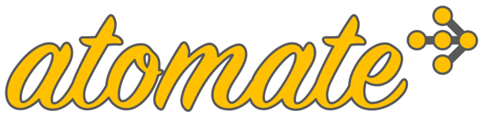
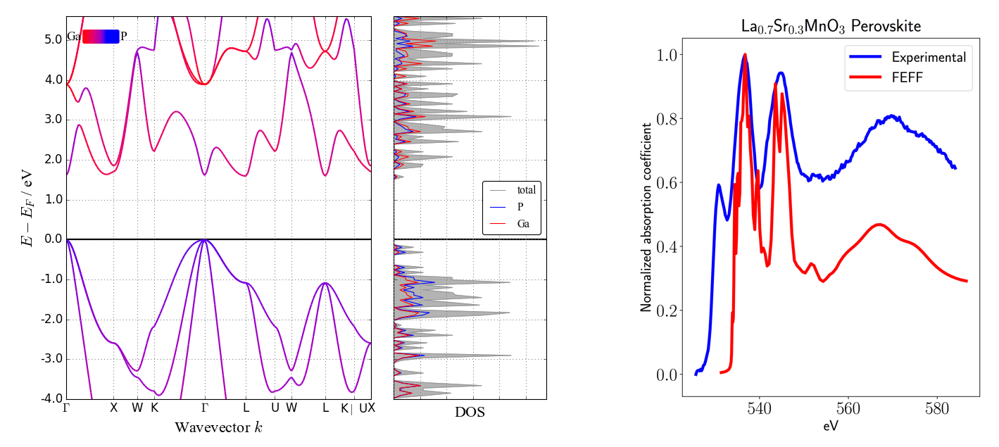

.. title:: atomate (Materials Science Workflows)

.. pull-quote:: | "Civilization advances by extending the number of important operations which we can perform without thinking about them."
                |    - Alfred North Whitehead

=======
atomate
=======

Theory and computations are powerful tools for understanding and designing materials, but conventional
software for performing these computations are still difficult to use, understand, and automate.
atomate makes it possible to perform complex materials science computations using
very straightforward statements. Features of atomate include:

* It is built on top of state-of-the-art open-source libraries: **pymatgen**, **custodian**, and **FireWorks**. Building off these libraries means that atomate can not only serve as a simple and friendly introduction to computational materials science, but that it is powerful enough for even the most demanding of theory users that require precise control and massive execution.
* It is easy to get "standard" workflows for a wide variety of desired materials properties - optimized structures, band structures, electronic transport properties, dielectric constants, and much more. Just provide a crystal structure (that's it!) and let atomate set up a complete workflow that provides the property you are interested in. You can do this for a single material, 100 materials, or 100,000 materials.
* One can easily change "standard workflows" - whether that is changing some of the default calculation parameters or recomposing the workflow (adding new calculations, removing steps, etc.) - using a very expressive syntax. One can compose very complex new workflows simply by chaining together pre-built calculation steps.
* A system of "powerups" that let you quickly decorate a bare workflow with useful special properties. Just feed the workflow through the powerup and your workflow will have the feature enabled. A config file allows you to automatically set the powerups you want to apply most often.
* It can build large databases of output properties that you can query, analyze, and share in a systematic way.
* It automatically keeps meticulous records of jobs, their directories, runtime parameters, etc.
* Jobs can be run on a variety of computing systems, queue systems, and architectures.
* atomate uses a standard interface for adding new types of calculations and workflows such that it is possible for users to contribute new features and grow the capabilities of the software over time.

**Note**: Atomate is primarily built to work with the `VASP <https://www.vasp.at>`_ electronic structure software, but it is the intention of atomate to support a variety of software. For example, `FEFF <http://leonardo.phys.washington.edu>`_ software integration has been recently added and other calculation packages are also under development.

=========
Workflows
=========

    Example of GaP band structure (left) computed via atomate/VASP and La0.7Sr0.3MnO3 ELNES spectra (right) computed via atomate/FEFF.

Some of the workflows available as of June 2017 are:

* electronic band structures
* BoltzTraP
* full elastic tensor
* equation of state
* piezoelectric tensor
* dielectric tensor
* ferroelectricity
* nudged elastic band
* Raman spectroscopy
* XAS and EELS spectra (FEFF package)

One can customize any of the above workflows. Also, one can create new workflows - either from scratch, or by reusing components from the above workflows (atomate's infrastructure makes this simple). For the VASP package, raw workflows (more parameter settings) are in ``atomate/vasp/workflows/base`` and preset workflows (generally only require a crystal structure) are in ``atomate/vasp/workflows/presets``. Other packages should have corresponding directories.

==========
The basics
==========

.. figure:: _static/bandstructure_wf.png
    :alt: Band structure workflow
    :scale: 25%

    Anatomy of a band structure workflow consisting of 4 separate calculations (Fireworks) and for which each calculation has multiple steps (Firetasks). The anatomy of this workflow is covered in more detail in the atomate tutorials.

The basics of setting up and running calculations
=================================================

The main function of atomate's automatic calculation infrastructure is to help the user generate Workflow objects as defined by the FireWorks workflow software. Once the user has a Workflow object, they can use the FireWorks package to store, manage, organize, and execute the calculations on various types of computing resources in a very general way. All the nitty-gritty details of the Workflow object and its execution are in the `FireWorks documentation <http://pythonhosted.org/FireWorks>`_. The atomate docs and tutorials will walk you through the most important points of how to define and execute Workflows, but to learn all the possible features (e.g., monitoring the status of your calculations through a web interface, reprioritizing jobs, etc.), check the FireWorks documentation.

Atomate itself makes it easy for users to get Workflow objects for many types of simulation procedures. In the simplest case, the user just provides a crystal structure and atomate will return a fully-functioning Workflow - even for complex simulation procedures. Thus, atomate encapsulates methods of performing simulations and materials analysis procedures into reproducible Workflow objects that can be run across multiple computing systems. In addition, atomate provides multiple ways for you to customize these workflows as needed, thus letting you decide whether important parameters should be determined automatically or whether they should be manually overridden. These features and file I/O with various codes are largely provided by the `pymatgen <http://www.pymatgen.org>`_ library.

The basics of parsing calculation results
=========================================

Most workflows defined by atomate not only execute a calculation but also contain steps to analyze the output files and, optionally, store the results in a user-friendly database where they can be easily searched. Much of the infrastructure to parse various file output types is provided by pymatgen and the database technology used to store results is MongoDB. In general, each calculation is represented by a single document in MongoDB that summarizes the important inputs and outputs. Atomate also includes "builders" that combine the results from multiple calculations into higher-level analyses. A simple example of this is to compile all the various calculations on a given crystal structure to provide a summary report of all computed properties for that structure. The builders package in atomate allows one to get high-level summaries of calculation results, which becomes particularly important when running many calculations. Note that plotting and other high-level analyses can be performed by the pymatgen package.

===========
What's new?
===========

Track changes to atomate through the :doc:`changelog`.

==============
Citing atomate
==============

A paper on atomate is in submission. For now, you can cite the following two works::

    (1) Jain, A.; Ong, S. P.; Chen, W.; Medasani, B.; Qu, X.; Kocher, M.;
    Brafman, M.; Petretto, G.; Rignanese, G.-M.; Hautier, G.; Gunter, D.;
    Persson, K. A. FireWorks: a dynamic workflow system designed for
    high-throughput applications, Concurr. Comput. Pract. Exp., 2015, 22,
    doi:10.1002/cpe.3505.

    (2) Ong, S. P.; Richards, W. D.; Jain, A.; Hautier, G.; Kocher, M.; Cholia,
    S.; Gunter, D.; Chevrier, V. L.; Persson, K. a.; Ceder, G. Python Materials
    Genomics (pymatgen): A robust, open-source python library for materials
    analysis, Comput. Mater. Sci., 2013, 68, 314–319,
    doi:10.1016/j.commatsci.2012.10.028.

.. _contributing-label:

================================
Contributing / Contact / Support
================================

Want to see something added or changed? There are many ways to make that a reality! Some ways to get involved are:

* Help us improve the documentation - tell us where you got 'stuck' and improve the install process for everyone.
* Let us know if you need support for a queueing system or certain features.
* Point us to areas of the code that are difficult to understand or use.
* Contribute code! You can do this by forking `atomate on Github <https://github.com/hackingmaterials/atomate>`_ and submitting a pull request.

The list of contributors to atomate can be found :doc:`here </contributors>`.

There is an `atomate Google Group`_ dedicated to discussion and basic support.

.. _atomate Google Group: https://groups.google.com/forum/#!forum/atomate

=======
License
=======

atomate is released under a modified BSD license; the full text can be found :doc:`here</license>`.

=========================
Documentation & Tutorials
=========================

Installation
============

.. toctree::
    :maxdepth: 3

    installation

Running workflows
=================

.. toctree::
    :maxdepth: 3

    running_workflows

Creating and customizing workflows
==================================

.. toctree::
    :maxdepth: 3

    creating_workflows
    customizing_workflows

Changelog, contributors, license
================================

.. toctree::
    :maxdepth: 1

    changelog
    contributors
    license

Reference
=========

.. toctree::
    :maxdepth: 1

    workflow_yaml_reference
    concepts

==================
Code documentation
==================
Autogenerated code documentation below:

* :ref:`genindex`
* :ref:`modindex`
* :ref:`search`
