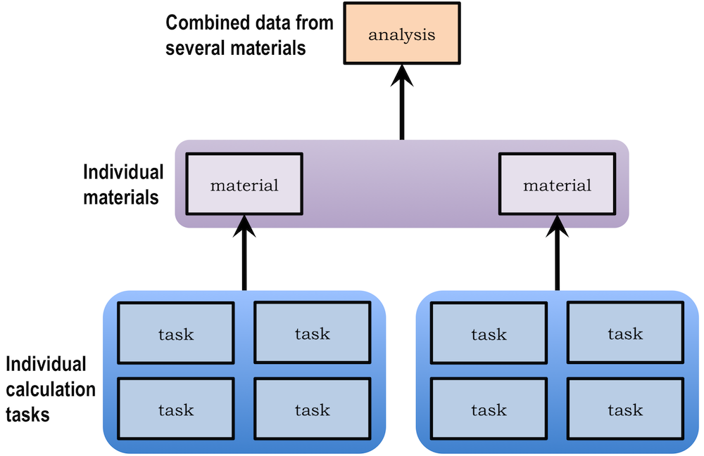

.. title:: Builders
.. _builders:

========================================================
Builders: creating calculation reports for data analysis
========================================================

Introduction
============

By default, atomate parses the results of each calculation ("task") and stores the result in
MongoDB. Although it is often useful to have such a "calculation-centric" view of the data, in
which each document in the database represents one calculation, it is sometimes even more useful
to have a database in which each document summarizes all calculated properties of a given material.

A "builder" in atomate summarizes all calculated data on a single material by collecting together
information from multiple tasks. One can also use builders to do post-processing such as computing
and storing materials descriptors that can be helpful in data analysis. Thus, the main goal of a
builder is take the somewhat "raw" information from a set of calculation tasks and derive a summary
and higher-level information from a materials perspective.

A high-level diagram of the build process is shown below.

    Diagram of the build process, which collects lower-level information such as tasks and organizes it into higher-level collections like materials.

The core builder: TasksMaterialsBuilder
---------------------------------------

The core builder of atomate is TasksMaterialsBuilder. This builder will:

* automatically determine which tasks are on the same material using pymatgen's StructureMatcher
* collect together basic data from all those tasks into a single document that is stored in a new collection called "materials".

This core builder is one of the more complex builders because it needs to decide things like:

* what kinds of calculations should be considered as possible new materials? (for example, in general one would not like to consider a small deformation calculation performed for the purpose of elastic tensor calculation to be different "material" than its parent)
* if there are multiple calculation types that give different values of the same property for a single material, which calculation should be trusted?
* how can we decide if two calculations are on the same material?

However, this is the "core" builder because it begins the process of collecting together data from individual calculations and creating a single materials-centric report.

Other builders
--------------

Other builders can be found in the ``atomate.vasp.builders`` package. Refer to the code documentation to learn their various purposes.

Running builders
================

Running builders is simple. Note that running builders does not modify the source ``tasks`` collection; it only creates new collections and data. Thus, one can safely run the builders.

To try running builders, follow the example in ``atomate.vasp.builders.examples``. Afterwards, inspect your MongoDB database to find the new collections and data.

Note that builders have a reset() function in case you want to start over.