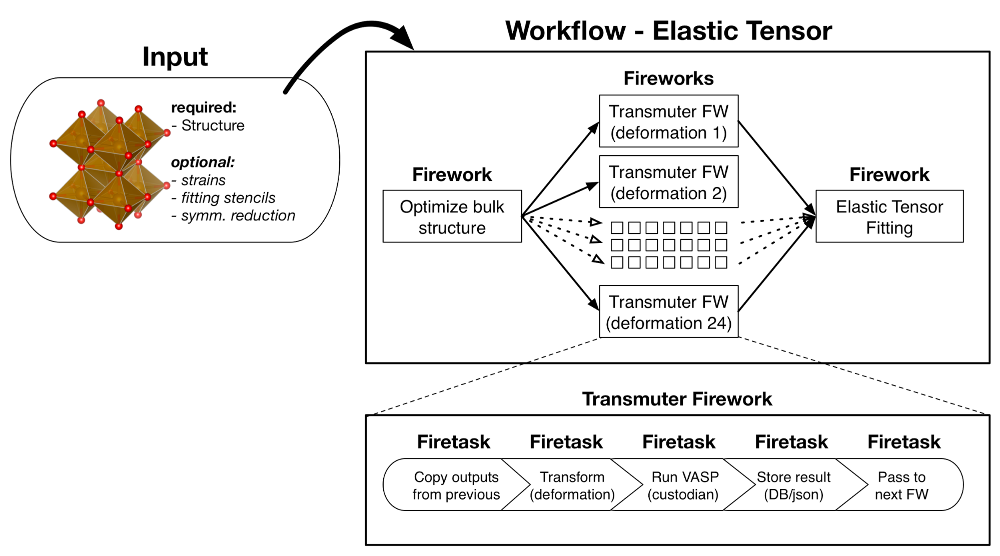
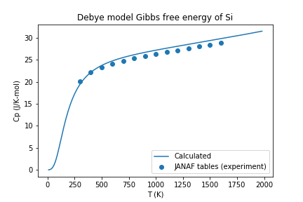

.. title:: Running Gibbs workflows
.. _running gibbs workflows:

=======================
Running Gibbs Workflows
=======================

Introduction
============

Standard density functional theory calculations are 0 K ground state calculations, but most materials are used and modeled at room temperature and above.
The Debye model and phonon calculations are two commonly used methods to obtain Gibbs free energies (:math:`G(p,T)`) of structures as a function of temperature.
Both the Debye model and phonon calculations are supported in atomate, where the Debye model analysis is based on the quasiharmonic technique presented in
Moruzzi et al. (`Phys. Rev. B 37, 790–799 (1988). <https://doi.org/10.1103/PhysRevB.37.790>`_) and implemented similar to Toher et al. (`Phys. Rev. B 90, 1–14 (2014). <https://doi.org/10.1103/PhysRevB.90.174107>`_.
Phonon calculation analysis is performed using `phonopy <https://atztogo.github.io/phonopy/>`_ (Togo & Tanaka `Scr. Mater. 108, 1–5 (2015). <https://doi.org/10.1016/j.scriptamat.2015.07.021>`_).

This tutorial will guide you through calculating the Gibbs free energy of diamond Si with atomate.
The resulting Gibbs free energies from the calculation will be queried from your Materials database and the heat capacity calculated with NumPy and compared to experimental data.

Objectives
==========

* Run an atomate preset workflow for the Gibbs free energy using Python
* Query for the calculation result in the Gibbs collection of the database
* Visualize the results with matplotlib

Gibbs Free Energy Workflows
===========================

Gibbs free energies are calculated in DFT based on the following relation:

.. math::

    G(p,T) = E(V) + pV + F_{\textrm{vib}}(V,T)

where :math:`E(V)` are the total energies calculated with DFT as a function of volume and :math:`F_{\textrm{vib}}(V,T)` is the vibrational contribution to the Helmholz energy.
This vibrational energy is calculated using a harmonic approximation, here via the Debye model.

To calculate the Gibbs free energy, total energies are calculated for several volumes, then vibrational contributions are added for each volume over a range of temperatures to give :math:`F(V,T)`.
Then an equation of state is fit for each set of energies and volumes at each temperature.
Several different equations of state are implemented in pymatgen and several of those are discussed in terms of the Debye model by Shang et al. (`Comput. Mater. Sci. 47, 1040–1048 (2010). <https://doi.org/10.1016/j.commatsci.2009.12.006>`_).
Using the fit equation of state, the volume that minimized the energy at a fixed pressure (usually, but not always :math:`p=0`) is found.
Finding the minimum volume at each temperature and fixed pressure yields the conversion from :math:`F_{\textrm{vib}}(V,T)` to :math:`G(V,T)`

From the perspective of a workflow, the Gibbs free energy workflow is procedurally similar to the elastic tensor workflow.
First the input structure is optimized, then volume of the optimize structure is deformed and energies calculated to yield the points for an E-V curve (or phonon calculations), finally the analysis workflow corresponding to the Debye model or phonon formalism is performed.

    Atomate elastic tensor workflow. This uses the same pattern as the Gibbs free energy workflow, but the analysis step (final Firework) calculates the elastic tensor instead of Gibbs free energies.

Running a Gibbs Free Energy Workflow
====================================

Setup
-----

Make sure you have completed the installation tutorial.
Next, create a folder on your HPC resource for this tutorial.
It can be located anywhere.
You'll keep all of the files for this tutorial there.

If you do not already have important prior results in your atomate environment, start fresh by running::

    lpad reset

.. warning:: This will reset all of your previous Fireworks and Workflows in your LaunchPad. Do not do this if you have actual results that you want to keep!

If you do not or want to reset your LaunchPad, you can set up a different database to use for tutorials or simply accept mixing your previous results and workflows with the contents of this tutorial in your database.

Use Python to generate and add the workflow
-------------------------------------------

We'll use diamond Si as a simple example and get the structure from the Materials Project.
This requires that you set up an API key in your ``.pmgrc.yaml``.
In the installation tutorial, you set up your ``FW_config.yaml``, you indicated the atomate Fireworks can be found at :py:mod:`atomate.vasp.fireworks`.
Similarly, atomate preset workflows can be imported from :py:mod:`atomate.vasp.workflows.presets.core`, which thinly wraps the base workflows (:py:mod:`atomate.vasp.workflows.base`) allowing for common settings to be changed with configuration dictionaries.
And we can setup the workflow and add it to our LaunchPad ready to run in just a few lines of Python.

**Create the workflow script**

In the directory you created, make a Python script named ``gibbs.py`` with the following contents:

.. code-block:: python

    #!/usr/bin/env python
    import numpy as np
    from pymatgen.ext.matproj import MPRester
    from fireworks import LaunchPad
    from atomate.vasp.workflows.presets.core import wf_gibbs_free_energy

    # Get the structure from the Materials Project
    with MPRester() as mpr:
        struct = mpr.get_structure_by_material_id('mp-149')

    # Set up the deformation matricies, where each deformation is a 3x3 list of strains.
    # There will be 7 structures between +/- 10% volume. Note that the 1/3 power is so
    # that we scale each direction by (x+1)^(1/3) and the total volume by (x+1).
    deformations = [(np.eye(3)*((1+x)**(1.0/3.0))).tolist() for x in np.linspace(-0.1, 0.1, 7)]

    # Create the configurations dictionary, defining the temperature range,
    # Poisson ratio (from experiments or the Materials Project), turning on consideration
    # of anharmonic contributions, and finally the deformation matrix describing points
    # on the energy vs. volume curve.
    c = {"T_MIN": 10, "T_STEP": 10, "T_MAX": 2000,
         "POISSON": 0.20, "ANHARMONIC_CONTRIBUTION": True,
         "DEFORMATIONS": deformations}

    # Create the workflow
    workflow = wf_gibbs_free_energy(struct, c)

    # Create the launchpad and add our workflow
    launchpad = LaunchPad.auto_load()
    launchpad.add_wf(workflow)

Note that here we used a Poisson ratio of 0.2, found at the Materials Project `entry for Si <https://materialsproject.org/materials/mp-149/>`_.
In the Debye model, the Poisson ratio controls the shape and magnitude of the elbow in the heat capacity curve.
Typical materials are sometimes idealized to have a Poisson ratio of 0.33, but to have the most accurate ratio will give more accurate heat capacities near the low temperature limit.
Poisson ratios can be taken from experimental references, from the Materials Project and are often comparable for chemically similar structures (alternatively, they be first calculated via the elastic tensor workflow).

Since we are potentially interested in the high-temperature thermodynamic behavior of Si, we set the anharmonic contribution to ``True``, so that we can properly deviate from the high-temperature limit of the Debye model of :math:`3R` based on the Gruneisen parameter, :math:`\gamma`.

**Create and add the workflow to LaunchPad**

.. code-block:: bash

    python gibbs.py

Running the workflow
--------------------

The following command will submit a single job to the batch queue configured in ``my_qadapter.yaml``.
Assuming the same configuration as in the installation tutorial, the job will launch Fireworks from your LaunchPad until all of them have completed or you run out of walltime.
This workflow should only take few minutes.

.. code-block:: bash

    qlaunch singleshot

You can go to the output files from the batch job (``*.out`` and ``*.error``) at the launch directories to make sure everything went well or check the LaunchPad (``lpad get_wflows``).

Analyzing an Equation of State Workflow
=======================================

Finally, we'll analyze the results of our Gibbs free energy calculation.
Here we'll compare the heat capacity from our DFT calculation with experimental values.
Simply add the following Python script (``gibbs-analysis.py``) to your folder and run it

.. code-block:: python

    from atomate.vasp.database import VaspCalcDb
    from pymatgen.core import Structure
    import numpy as np

    import matplotlib.pyplot as plt

    # create the atomate db from your db.json
    PATH_TO_MY_DB_JSON = '/path/to/my/db.json'
    atomate_db = VaspCalcDb.from_db_file(PATH_TO_MY_DB_JSON)

    # use the Gibbs collection
    gibbs_coll = atomate_db.db['gibbs_tasks']

    # get our task for the formula
    gibbs_entry = gibbs_coll.find_one({'formula_pretty': 'Si'})

    # set up the pymatgen structure
    struct = Structure.from_dict(gibbs_entry['structure'])
    eVatom_to_kjmol = 96.485340095*1000/len(struct)

    # Gibbs free energy data from Barin for Si:
    T_barin = range(300, 1700, 100)
    Cp_barin = [20.050, 22.142, 23.330, 24.154, 24.803, 25.359, 25.874,
                26.338, 26.778, 27.196, 27.614, 28.033, 28.451, 28.870]

    T_calc = np.array(gibbs_entry['temperatures'])
    G_calc = np.array(gibbs_entry['gibbs_free_energy'])*eVatom_to_kjmol
    # Numerical derivative of the heat capacity, considering a step size of 10
    # Note: the truncated last two values are to account for the numerical derivative endpoint error
    Cp_calc = -T_calc[:-2]*np.gradient(np.gradient(G_calc, 10), 10)[:-2]

    # Plot our calculated Gibbs free energies vs. those from JANAF
    plt.scatter(T_barin, Cp_barin, label='JANAF tables (experiment)')
    plt.plot(T_calc[:-2], Cp_calc, label='Calculated')
    plt.title('Debye model Gibbs free energy of Si')
    plt.xlabel('T (K)')
    plt.ylabel('Cp (J/K-mol)')
    plt.legend()

    # save the figure
    plt.savefig('Si-heat-capacity.png')

If you open the saved figure, ``Si-heat-capacity.png``, it should match the one below!

    Heat capacity for Si calculated with atomate and compared with experimental values.

Conclusion
==========

In this tutorial we have further demonstrated the use of atomate preset workflows to easily calculate and analyze interesting materials properties.

To see what other preset workflows can be run, see the documentation that includes them at :py:mod:`atomate.vasp.workflows.presets`. They can be set up and run in exactly the same way as this tutorial, by passing in a structure and an optional configuration dictionary.

At this point, you might:

* Explore using builders to generate metadata: :ref:`builders`.
* Skip to learning how to create your own workflows that you can use and distribute: :ref:`creating workflows`.

